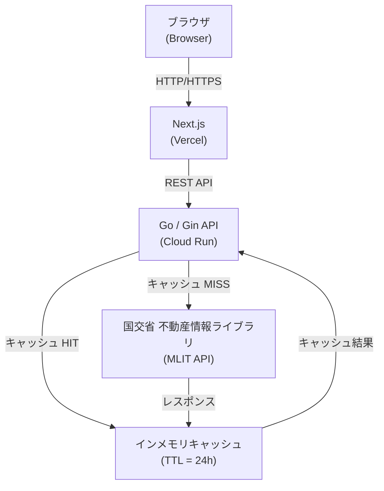
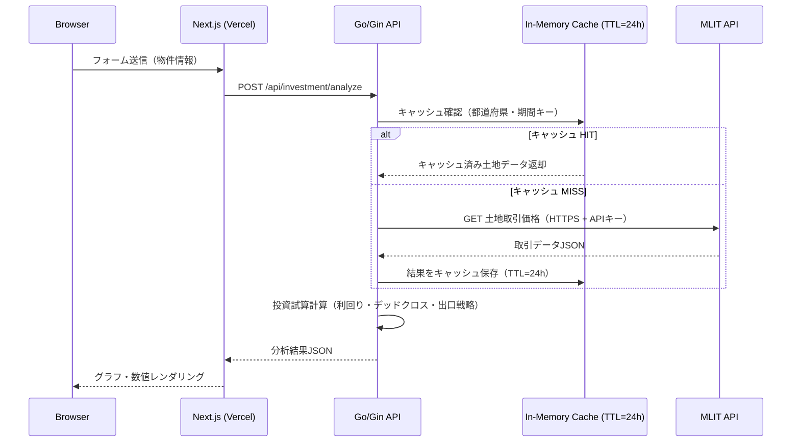

# Yield-Guard

> **はじめてお使いになる方へ（銀行員・不動産会社の方向け）**
>
> Yield-Guard は、不動産投資を検討しているお客様や担当者が「この物件は買っても大丈夫か？」を数字で確認できる無料のWebツールです。
> 土地の相場価格・表面利回り・ローン返済とのバランス・将来の売却益を自動で計算します。
> 専門的な知識がなくても、物件の金額と賃料を入力するだけで結果が表示されます。
> （インターネットブラウザから利用でき、インストール不要です）

不動産投資の意思決定をデータで支援するMVPツール。国土交通省の公式APIから土地取引価格を取得し、表面利回り・デッドクロス・出口戦略をリアルタイムで可視化する。

## 概要

「Yield-Guard」は不動産投資の3大リスクを定量化するツールです。

| 機能 | 内容 |
|------|------|
| **相場判定** | 国交省APIから土地取引実績を取得し、坪単価の平均・中央値と比較して割高/割安を即判定 |
| **8%境界線** | 表面利回りが8%を下回る場合、達成に必要な土地値・建築費の削減幅を逆算表示 |
| **デッドクロス予測** | 元金返済額が減価償却費を超える年を特定し、所得税負担増による黒字倒産リスクをグラフ化 |
| **出口戦略** | 任意年数後に利回り6%で売却した際の譲渡所得税込み手残り額（Equity）を算出 |
| **ストレステスト** | 空室率+10%・金利+1.5%時のキャッシュフロー変化をスライダーでリアルタイム可視化 |

## アーキテクチャ



### `/api/investment/analyze` リクエストフロー



**技術スタック**

- Backend: Go 1.25 / Gin / Clean Architecture
- Frontend: Next.js 16 (App Router) / TypeScript / Tailwind CSS v4 / Shadcn/UI / Recharts
- Data: 国土交通省 不動産情報ライブラリ API（APIキー必須・要申請）

## セットアップ

```bash
# リポジトリのクローン
git clone <repository-url>
cd yield-guard

# 環境変数の設定（プロジェクトルートに .env を作成）
cp .env.example .env
# .env を編集して MLIT_API_KEY を設定する
# APIキー申請: https://www.reinfolib.mlit.go.jp/api/request/（審査5営業日）
# APP_INTERNAL_API_KEY は本番環境（Vercel-Render 間認証）用。ローカルでは未設定でよい
```

### Docker（推奨）

```bash
# ビルドして起動（初回のみ時間がかかります）
make docker-up

# 停止
make docker-down
```

| サービス | URL |
|---|---|
| フロントエンド | http://localhost:3000 |
| バックエンド | http://localhost:8080 |

### ローカル開発（Docker不使用）

**バックエンド**

```bash
cd backend
go mod tidy
go run cmd/server/main.go
```

**フロントエンド**

```bash
cd frontend
npm install
npm run dev
```

## 使い方

1. バックエンドを起動 (`localhost:8080`)
2. フロントエンドを起動して `http://localhost:3000` にアクセス
3. 都道府県・市区町村を選択し「相場データ取得」をクリック
4. 土地価格・建築費・想定賃料・ローン条件を入力して「分析実行」

### APIエンドポイント

| メソッド | パス | 説明 |
|----------|------|------|
| `GET` | `/api/land-prices` | 土地取引価格一覧・統計 |
| `GET` | `/api/land-prices/compare` | 検討地と相場の比較 |
| `POST` | `/api/analyze` | 投資シミュレーション実行 |
| `GET` | `/api/prefectures` | 都道府県一覧 |
| `GET` | `/health` | ヘルスチェック |

**`POST /api/analyze` リクエスト例:**

```json
{
  "landPrice": 5000000,
  "buildingCost": 10000000,
  "miscExpenseRate": 0.07,
  "monthlyRent": 120000,
  "vacancyRate": 0.05,
  "loanAmount": 13000000,
  "annualLoanRate": 0.015,
  "loanYears": 35,
  "buildingType": "木造",
  "expenseRate": 0.20,
  "incomeTaxRate": 0.33,
  "holdingYears": 10,
  "exitYieldTarget": 0.06
}
```

## ディレクトリ構成

```
yield-guard/
├── .github/
│   └── workflows/
│       ├── backend-ci.yml          # Go vet / test -race / build
│       └── frontend-ci.yml         # lint / tsc / build
├── backend/
│   ├── Dockerfile                  # マルチステージビルド（BuildKitキャッシュ最適化）
│   ├── cmd/server/main.go          # エントリポイント
│   └── internal/
│       ├── domain/
│       │   ├── types.go            # ドメインモデル
│       │   ├── investment.go       # 収支計算ロジック（元利均等・減価償却・税金）
│       │   └── investment_test.go  # ユニットテスト
│       ├── mlit/
│       │   ├── client.go           # 国交省APIクライアント（リトライ・キャッシュ付き）
│       │   ├── cache.go            # TTL付きインメモリキャッシュ（24時間）
│       │   ├── client_test.go      # ユニットテスト（httptest モック）
│       │   ├── integration_test.go # 統合テスト（実API疎通・要APIキー）
│       │   └── types.go            # APIレスポンス型
│       └── api/
│           ├── handler.go          # HTTPハンドラー
│           └── router.go           # Ginルーター
├── docs/
│   ├── overview.md                 # 全体設計概要
│   ├── mlit-api-integration.md     # 国交省APIクライアント仕様
│   ├── domain-investment-calculation.md
│   └── ...
├── frontend/
│   ├── Dockerfile                  # マルチステージビルド
│   └── src/
│       ├── app/                    # Next.js App Router
│       ├── components/             # UIコンポーネント
│       ├── lib/                    # APIクライアント・計算ユーティリティ
│       └── types/                  # TypeScript型定義
├── docker-compose.yml              # backend + frontend 一括起動
├── .env.example                    # 環境変数テンプレート
└── README.md
```

## 開発

### よく使うコマンド

```bash
make help        # 利用可能なコマンド一覧
make dev         # 開発サーバー起動（backend :8080 + frontend :3000）
make docker-up   # Dockerコンテナをビルドして起動
make docker-down # Dockerコンテナを停止・削除
make test        # バックエンド・フロントエンドの全テスト実行
make lint        # バックエンド（golangci-lint）・フロントエンド lint
make build       # バックエンド・フロントエンドのビルド
```

### 国交省API 開発用リクエスト

`.env` の `MLIT_API_KEY` を使って国交省APIに直接リクエストできます（`jq` が必要）。

```bash
# 市区町村一覧を取得（XIT002）
make mlit-municipalities area=13        # 東京都

# 土地取引価格を取得（XIT001）
make mlit-land-prices area=13 year=2024 quarter=1 to_year=2024 to_quarter=4
make mlit-land-prices area=13 year=2024 quarter=1 to_year=2024 to_quarter=4 city=13101  # 千代田区
```

| パラメータ | 説明 | 例 |
|-----------|------|----|
| `area` | 都道府県コード（必須） | `13`=東京都, `27`=大阪府 |
| `year` / `to_year` | 取得開始・終了年（必須） | `2024` |
| `quarter` / `to_quarter` | 四半期（必須、1〜4） | `1` |
| `city` | 市区町村コード（任意） | `13101`=千代田区 |

個別に実行する場合：

```bash
# バックエンド
cd backend && go test -race ./... -v

# フロントエンド
cd frontend && npm test
```

### CI

PR・mainへのpush時に GitHub Actions が自動実行される（ワークフロー自身の変更でも再トリガーされる）。

| ワークフロー | トリガーパス | チェック内容 |
|---|---|---|
| Backend CI | `backend/**`, `backend-ci.yml` | `golangci-lint` / `go test -race` / `go build` |
| Frontend CI | `frontend/**`, `frontend-ci.yml` | `lint` / `tsc --noEmit` / `vitest run` / `build` |

Dependabot により Go modules・npm の依存パッケージが毎週月曜（JST）に自動更新される（エコシステムごとに1PR）。

### ビルド

```bash
make build
```

### 計算ロジック仕様

| 計算 | 式 |
|------|----|
| 表面利回り | `(月額賃料 × 12) / 総投資額` |
| 元利均等返済 | `P × r(1+r)^n / ((1+r)^n - 1)` |
| 減価償却（定額法） | `建築費 / 法定耐用年数` |
| デッドクロス | 元金返済額 > 減価償却費 となる最初の年 |
| 長期譲渡税率 | 20.315%（保有5年超） / 39.363%（5年以下） |

**法定耐用年数:** 木造 22年 / 軽量鉄骨 27年 / 重量鉄骨 34年 / RC造 47年

## ライセンス

Copyright (c) 2026 Keita Tashiro. All Rights Reserved.
