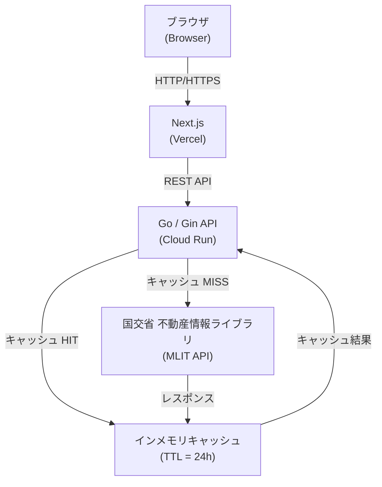

# Yield-Guard


不動産投資の意思決定をデータで支援するMVPツール。国土交通省の公式APIから土地取引価格を取得し、表面利回り・デッドクロス・出口戦略をリアルタイムで可視化する。

## 概要

| 機能 | 内容 |
|------|------|
| **相場判定** | 国交省APIから土地取引実績を取得し、坪単価の平均・中央値と比較して割高/割安を即判定 |
| **8%境界線** | 表面利回りが8%を下回る場合、達成に必要な土地値・建築費の削減幅を逆算表示 |
| **デッドクロス予測** | 元金返済額が減価償却費を超える年を特定し、所得税負担増による黒字倒産リスクをグラフ化 |
| **出口戦略** | 任意年数後に利回り6%で売却した際の譲渡所得税込み手残り額（Equity）を算出 |
| **ストレステスト** | 空室率+10%・金利+1.5%時のキャッシュフロー変化をリアルタイム可視化 |

## アーキテクチャ



**技術スタック**

- Backend: Go 1.25 / Gin / Clean Architecture → Cloud Run
- Frontend: Next.js 16 (App Router) / TypeScript / Tailwind CSS v4 / Shadcn/UI / Recharts → Vercel
- Data: 国土交通省 不動産情報ライブラリ API（APIキー必須・要申請）

## セットアップ

```bash
# リポジトリのクローン
git clone <repository-url>
cd yield-guard

# 環境変数の設定（プロジェクトルートに .env を作成）
cp .env.example .env
# .env を編集して MLIT_API_KEY を設定する
# APIキー申請: https://www.reinfolib.mlit.go.jp/api/request/（審査5営業日）
# APP_INTERNAL_API_KEY は本番環境（Vercel→Cloud Run 間認証）用。ローカルでは未設定でよい
```

### Docker（推奨）

```bash
make docker-up   # ビルドして起動
make docker-down # 停止
```

| サービス | URL |
|---|---|
| フロントエンド | http://localhost:3000 |
| バックエンド | http://localhost:8080 |

### ローカル開発（Docker不使用）

```bash
# バックエンド
cd backend && go run cmd/server/main.go

# フロントエンド
cd frontend && npm install && npm run dev
```

## 使い方

1. バックエンドを起動 (`localhost:8080`)
2. フロントエンドを起動して `http://localhost:3000` にアクセス
3. 都道府県・市区町村を選択し「相場データ取得」をクリック
4. 土地価格・建築費・想定賃料・ローン条件を入力して「分析実行」

## APIエンドポイント

| メソッド | パス | 説明 |
|----------|------|------|
| `GET` | `/health` | ヘルスチェック |
| `GET` | `/api/land-prices/stats` | 土地取引価格の統計情報 |
| `GET` | `/api/land-prices/compare` | 検討地と相場の比較 |
| `GET` | `/api/land-prices/estimate` | 土地価格の理論値推定 |
| `POST` | `/api/investment/analyze` | 投資シミュレーション（CF・デッドクロス・出口戦略） |
| `POST` | `/api/investment/simulate` | モンテカルロシミュレーション |
| `POST` | `/api/renovation/analyze` | リフォームROI計算 |
| `GET` | `/api/municipalities` | 市区町村一覧 |
| `GET` | `/api/station-ridership` | 駅乗降客数・需要スコア |
| `GET` | `/api/population-forecast` | 人口予測データ（250mメッシュ） |
| `GET` | `/api/land-appraisals` | 地価公示データ |
| `GET` | `/api/urban-risks` | 都市計画リスク（立地適正化計画・盛土・都市計画道路・災害履歴） |
| `GET` | `/api/hazard` | 自然災害ハザード（洪水・高潮・津波・土砂崩れ） |
| `GET` | `/api/investment-score` | 投資適地スコア（11 MLIT API並列実行・0–100点） |

リクエスト/レスポンス仕様の詳細は [docs/api-reference.md](docs/api-reference.md) を参照。

## ドキュメント体系

| 対象層 | ドキュメント |
|--------|-------------|
| 全体設計・デプロイフロー | [docs/overview.md](docs/overview.md) |
| インフラ・観測基盤（OTel・Cloud Monitoring） | [docs/architecture.md](docs/architecture.md) |
| APIリファレンス（全エンドポイント詳細） | [docs/api-reference.md](docs/api-reference.md) |
| ドメイン計算仕様（投資・デッドクロス・出口戦略） | [docs/domain-investment-calculation.md](docs/domain-investment-calculation.md) |
| ドメイン計算仕様（減価償却・耐用年数） | [docs/domain-depreciation-dead-cross.md](docs/domain-depreciation-dead-cross.md) |
| ドメイン計算仕様（出口・譲渡所得税） | [docs/domain-exit-strategy.md](docs/domain-exit-strategy.md) |
| ドメイン計算仕様（用途地域・ゾーニングリスク） | [docs/domain-zoning.md](docs/domain-zoning.md) |
| MLIT API連携仕様（タイル変換・キャッシュ・正規化） | [docs/mlit-api-integration.md](docs/mlit-api-integration.md) |
| フロントエンドコンポーネント仕様 | [docs/frontend-components.md](docs/frontend-components.md) |
| セキュリティ・認証（WIF・Secret Manager） | [docs/security.md](docs/security.md) |
| ユースケース一覧（UC-01〜UC-14） | [docs/usecases.md](docs/usecases.md) |
| 不動産投資 概念・指標 解説 | [docs/domain-glossary.md](docs/domain-glossary.md) |

## 開発

```bash
make help        # 利用可能なコマンド一覧
make dev         # 開発サーバー起動（backend :8080 + frontend :3000）
make docker-up   # Dockerコンテナをビルドして起動
make docker-down # Dockerコンテナを停止・削除
make test        # バックエンド・フロントエンドの全テスト実行
make lint        # golangci-lint + eslint + tsc --noEmit
make build       # go build + next build
make integration # 統合テスト（実 MLIT API 疎通・MLIT_API_KEY 必須）
```

**MLIT API デバッグ:**

```bash
make mlit-municipalities area=13                                             # 市区町村一覧（東京都）
make mlit-land-prices area=13 year=2024 quarter=1 to_year=2024 to_quarter=4 # 土地取引価格
```

### CI

| ワークフロー | トリガーパス | チェック内容 |
|---|---|---|
| Backend CI | `backend/**` | `golangci-lint` / `go test -race` / `go build` |
| Frontend CI | `frontend/**` | `lint` / `tsc --noEmit` / `vitest run` / `next build` |

## ライセンス

Copyright (c) 2026 Keita Tashiro. All Rights Reserved.
