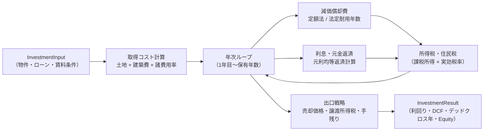
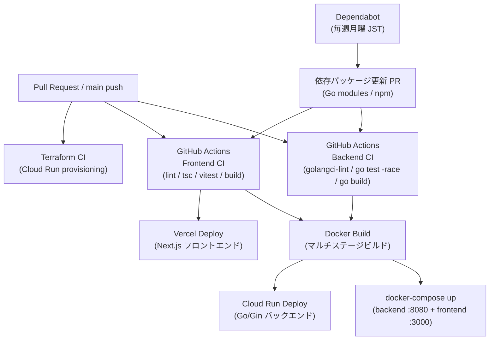

# アーキテクチャ詳細

## 投資計算フロー



### 計算式サマリー

| 計算 | 式 |
|------|----|
| 表面利回り | `(月額賃料 × 12) / 総投資額` |
| 元利均等返済 | `P × r(1+r)^n / ((1+r)^n - 1)` |
| 減価償却（定額法） | `建築費 / 法定耐用年数` |
| デッドクロス | 元金返済額 > 減価償却費 となる最初の年 |
| 長期譲渡税率 | 20.315%（保有5年超） / 39.363%（5年以下） |

**法定耐用年数:** 木造 22年 / 軽量鉄骨 27年 / 重量鉄骨 34年 / RC造 47年

---

## デプロイフロー



### CI ワークフロー詳細

| ワークフロー | トリガーパス | チェック内容 |
|---|---|---|
| Backend CI | `backend/**`, `backend-ci.yml` | `golangci-lint` / `go test -race` / `go build` |
| Frontend CI | `frontend/**`, `frontend-ci.yml` | `lint` / `tsc --noEmit` / `vitest run` / `build` |

Dependabot により Go modules・npm の依存パッケージが毎週月曜（JST）に自動更新される（エコシステムごとに1PR）。

---

## Observability（可観測性）

### 概要

バックエンドは OpenTelemetry SDK で計装済み。`GOOGLE_CLOUD_PROJECT` 環境変数の有無でエクスポーター先が切り替わる。

| 環境 | エクスポーター | 送信先 |
|------|--------------|--------|
| ローカル開発（未設定） | `stdouttrace` / `stdoutmetric` | コンソール標準出力 |
| 本番（Cloud Run） | `cloudtrace` / `monitoring` | Cloud Trace / Cloud Monitoring |

### 計装ポイント

| 計装 | 実装箇所 | 収集内容 |
|------|---------|---------|
| HTTP リクエストスパン | `otelgin` ミドルウェア（自動） | 全エンドポイントのトレース |
| 投資分析リクエスト数 | `telemetry.AnalyzeRequestsTotal` | `POST /api/investment/analyze` のカウント |
| MLIT API レイテンシ | `telemetry.MLITAPILatencyHistogram` | 国交省 API への呼び出し時間（秒） |
| MLIT キャッシュヒット/ミス | `telemetry.MLITCacheHits` / `MLITCacheMisses` | TTL キャッシュの効果測定 |

### Cloud Run 設定（Terraform 管理）

```
GOOGLE_CLOUD_PROJECT = <project_id>   # cloud_run.tf
```

Cloud Run SA に付与する IAM ロール（`iam.tf`）:

| ロール | 用途 |
|--------|------|
| `roles/cloudtrace.agent` | Cloud Trace へのスパン書き込み |
| `roles/monitoring.metricWriter` | Cloud Monitoring へのメトリクス書き込み |

認証は ADC（Application Default Credentials）が Cloud Run 上で自動処理するため、コード内での認証設定は不要。
