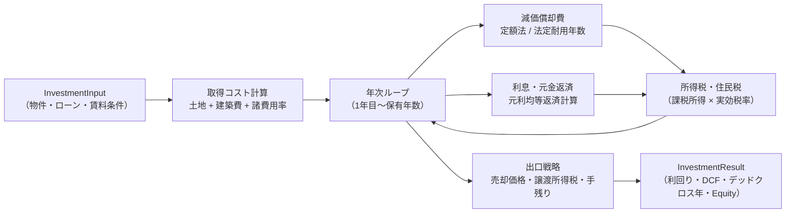
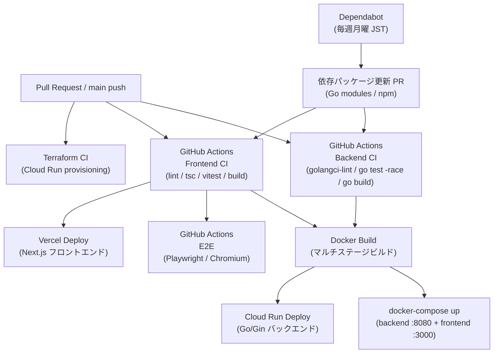
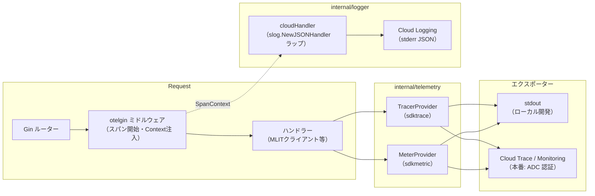

# アーキテクチャ詳細

## 技術選定の背景（Why）

### Go / Gin

静的型付けによるコンパイル時エラー検出、シングルバイナリへのビルド、低メモリフットプリントが主な理由。
MLIT API への並列リクエストやキャッシュ処理でゴルーチンが有効に機能し、Python/FastAPI と比べて Cloud Run の最小インスタンスコストを抑えられる。
Gin は標準 `net/http` との互換性が高く、ミドルウェア合成が明瞭で、将来的な gRPC 移行コストが低い。

### Clean Architecture

外部 API（MLIT 不動産情報ライブラリ）への依存を `mlit/` パッケージに閉じ込め、ドメインロジックから切り離す目的で採用。
`domain/` パッケージのユニットテストが HTTP クライアントや外部通信なしに実行できるため、CI でのフィードバックが速い。
将来的に別の不動産データソースへ切り替える際も、`mlit/client.go` の実装を差し替えるだけでドメインロジックへの影響がない。

### Next.js App Router

React Server Components（RSC）によるサーバーサイドレンダリングで初期表示を高速化しつつ、インタラクティブ部分は Client Components として分離できる。
Vercel との統合により、プレビュー URL・エッジキャッシュ・環境変数管理が統一されている。
バックエンドとのインターフェース不整合は、swagger.json 由来の生成型（`api.generated.ts`）を主要型として直接使用し、フロント固有の手書き型も契約テスト（`types/__tests__/api-contract.ts`）で生成型と照合するため、`tsc --noEmit` でビルド時に検出できる。

### Cloud Run

GCE（常時起動 VM）や GKE（Kubernetes クラスター）と比べ、リクエストがないときはインスタンスがゼロになるサーバーレスモデルが、本プロジェクトのトラフィックパターン（日中ピーク、夜間ほぼゼロ）に適している。
コンテナイメージを直接デプロイできるため Kubernetes の運用知識が不要で、最小構成チームでも維持しやすい。
コールドスタートは数秒かかるが、不動産投資シミュレーションという用途ではユーザーが許容できる範囲内。

### OpenTelemetry + slog

OpenTelemetry SDK を使うことで、ベンダーロックインなしに GCP Cloud Trace へトレースを送信できる。将来的に Jaeger や Datadog へ切り替える場合もコード変更が最小限。
Go 標準ライブラリ `log/slog`（Go 1.21 で導入）を採用することで外部ロギングライブラリへの依存をゼロにし、構造化ログを標準的な方法で出力する。
Cloud Run の stdout ログが Cloud Logging に自動収集されるため、別途エージェントやサイドカーが不要。

---

## 投資計算フロー



### 計算式サマリー

| 計算 | 式 |
|------|----|
| 表面利回り | `(月額賃料 × 12) / 総投資額` |
| 元利均等返済 | `P × r(1+r)^n / ((1+r)^n - 1)` |
| 減価償却（定額法） | `建築費 / 法定耐用年数` |
| デッドクロス | 元金返済額 > 減価償却費 となる最初の年 |
| 長期譲渡税率 | 20.315%（保有5年超） / 39.363%（5年以下） |

**法定耐用年数:** 木造 22年 / 軽量鉄骨 27年 / 重量鉄骨 34年 / RC造 47年

---

## デプロイフロー



### CI ワークフロー詳細

| ワークフロー | トリガーパス | チェック内容 |
|---|---|---|
| Backend CI | `backend/**`, `backend-ci.yml` | `golangci-lint` / `go test -race` / `go build` |
| Frontend CI | `frontend/**`, `frontend-ci.yml` | `lint` / `tsc --noEmit` / `vitest run` / `build` / Vercel デプロイ（main push: 本番 / PR: プレビュー URL を PR コメントに自動投稿） |
| E2E（Frontend CI内） | `frontend/**`, `frontend-ci.yml` | `playwright test`（PR: `@p1`+`@p2` のみ / main push: 全10件） |
| Vercel プレビュー削除 | `frontend/**`, `vercel-preview-cleanup.yml` | PR クローズ時にプレビューデプロイを削除（`frontend-ci.yml` の `cancel-in-progress` による競合キャンセルを防ぐため独立ワークフロー化） |

Dependabot により Go modules・npm の依存パッケージが毎週月曜（JST）に自動更新される（エコシステムごとに1PR）。

---

## インフラ・セキュリティ

### サービスアカウント設計

SA（Service Account）を用途ごとに分離し、最小権限を実現している。

| SA | メール | 用途 | 主な権限 |
|---|---|---|---|
| deployer | `sa-yield-guard-prod-deployer@...` | GitHub Actions / Terraform 専用 | `projectIamAdmin`, `serviceAccountAdmin`, `artifactregistry.repoAdmin`, `run.developer`, `storage.admin`（tfstate のみ） |
| runtime | `sa-yield-guard-prod@...` | Cloud Run アプリ実行専用 | `secretmanager.secretAccessor`, `cloudtrace.agent`, `monitoring.metricWriter` |

**分離の背景**: 以前は CI/CD とランタイムが同一 SA を共有していた。`terraform apply` に必要な `projectIamAdmin` がランタイム SA にも付与されており、アプリ脆弱性経由で GCP プロジェクト全体を掌握できる権限昇格リスクがあった（Issue #188 対応）。

### Workload Identity Federation（WIF）

GitHub Actions → GCP 認証にパスワード不要の OIDC 連携を使用する。

```
GitHub Actions (OIDC token)
  → WIF Pool (github-pool-prod)
  → WIF Provider (github-provider)
  → impersonate deployer SA
```

- `SA_EMAIL` GitHub Secret: deployer SA のメールアドレスを設定
- `WIF_PROVIDER` GitHub Secret: WIF プロバイダーのリソース名を設定
- トークン交換は `glkt3912/yield-guard` リポジトリのみに制限（`attribute_condition`）

### Terraform 状態管理

Terraform state は GCS バケット `yield-guard-tfstate`（prefix: `yield-guard/prod`）に保存。deployer SA が `roles/storage.admin`（lock ファイル書き込み含む）を持つ。

### Cloud Run 削除保護

`terraform/cloud_run.tf` で `deletion_protection = true` を設定している。`terraform destroy` の誤実行および Cloud Console からの手動削除を GCP API レベルでブロックする。削除が必要な場合は `false` に戻して `apply` してから `destroy` する。

---

## 観測基盤（OpenTelemetry + 構造化ロギング）

### スタック概要

| レイヤー | 実装 | パッケージ |
|---|---|---|
| トレース / メトリクス | OpenTelemetry Go SDK | `backend/internal/telemetry/setup.go` |
| HTTP スパン自動計装 | `otelgin` ミドルウェア | `go.opentelemetry.io/contrib/instrumentation/github.com/gin-gonic/gin/otelgin` |
| 構造化ログ | `slog` JSON ハンドラー（Cloud Logging 準拠） | `backend/internal/logger/logger.go` |
| ログ ↔ トレース相関 | slog ハンドラーが OTel SpanContext からトレースフィールドを注入 | 同上 |

### OTel シグナルフロー



### エクスポーター切り替え

`GOOGLE_CLOUD_PROJECT` 環境変数の有無で自動切り替えする。

| 環境 | `GOOGLE_CLOUD_PROJECT` | トレース出力先 | メトリクス出力先 |
|---|---|---|---|
| ローカル開発 | 未設定 | stdout（整形JSON） | stdout |
| Cloud Run 本番 | GCP プロジェクト ID | Cloud Trace（ADC 認証） | Cloud Monitoring（ADC 認証） |

Cloud Run ランタイム SA には `roles/cloudtrace.agent` と `roles/monitoring.metricWriter` が必要（`terraform/iam.tf` で管理）。トレースエクスポーターは `otlptracehttp` + `gcpAuthTransport` を使用し、`google.DefaultTokenSource`（ADC）でトークンを取得して `Authorization: Bearer` ヘッダーに付与する。エンドポイントは `OTEL_EXPORTER_OTLP_TRACES_ENDPOINT` 環境変数で変更可能（デフォルト: `https://telemetry.googleapis.com/v1/traces`）。

### 構造化ログフォーマット（Cloud Logging 準拠）

`logger.Init(os.Stderr)` を `main()` 先頭で呼ぶことでグローバル `slog` デフォルトロガーを設定する。

```json
{
  "severity": "INFO",
  "message": "access",
  "method": "GET",
  "path": "/api/land-prices/stats",
  "status": 200,
  "latency_ms": 42,
  "logging.googleapis.com/trace": "projects/my-project/traces/abc123...",
  "logging.googleapis.com/spanId": "def456...",
  "logging.googleapis.com/trace_sampled": true
}
```

- `severity` / `message` フィールド名は Cloud Logging が自動パースする予約名
- `logging.googleapis.com/trace` を付与することで Cloud Logging UI でトレースと相関表示できる
- `GOOGLE_CLOUD_PROJECT` が未設定（ローカル）の場合、トレースフィールドはスキップされる

### メトリクス計装

`telemetry.Setup()` 後、以下のグローバル計測器が有効になる。

| 計測器名 | 種別 | 説明 |
|---|---|---|
| `analyze.requests.total` | Counter | 投資分析リクエスト数 |
| `mlit.api.request.duration` | Histogram | MLIT API リクエストレイテンシ（秒） |
| `mlit.cache.hits` | Counter | MLIT インメモリキャッシュ ヒット数 |
| `mlit.cache.misses` | Counter | MLIT インメモリキャッシュ ミス数 |

### Cloud Monitoring ダッシュボード・アラートポリシー

`terraform/monitoring.tf` で以下を管理する。

**ダッシュボード（`google_monitoring_dashboard`）**

Cloud Console > Monitoring > Dashboards の "Yield Guard" ダッシュボードに4パネルを表示する。

| パネル | メトリクス |
|--------|-----------|
| MLIT API 応答時間 P99 | `workload.googleapis.com/mlit.api.request.duration`（`ALIGN_PERCENTILE_99`） |
| キャッシュ ヒット/ミス | `workload.googleapis.com/mlit.cache.hits/misses`（`ALIGN_RATE`） |
| 投資分析 API 呼び出し数 | `workload.googleapis.com/analyze.requests.total`（`ALIGN_RATE`） |
| Cloud Run 5xx エラー | `run.googleapis.com/request_count`（`response_code_class="5xx"` でフィルタ） |

**アラートポリシー（`google_monitoring_alert_policy`）**

| ポリシー | 判定方式 | MQL / フィルタ概要 | 継続時間 |
|----------|----------|-------------------|---------|
| MLIT API P99 > 15s | MQL | `align delta(5m) \| percentile(99) \| condition val() > 15`（CUMULATIVE DISTRIBUTION のため MQL で変換） | 5 分 |
| Cloud Run 5xx エラー率 > 5% | MQL | `align rate(5m)` で各ブランチ整列後 `ratio`（5xx / 全体）| 5 分 |
| キャッシュヒット率 < 50% | MQL | `align rate(10m)` で各ブランチ整列後 `ratio`（miss / (miss+hit)） | 10 分 |
| インスタンス数 > 1（上限到達） | `condition_threshold` | `resource.type="cloud_run_revision"` + `ALIGN_MAX` + `REDUCE_MAX`、閾値 1（> 1 = ≥ 2） | 5 分 |

通知先メールアドレスは `var.notification_email`（`terraform.tfvars` で設定、gitignore 済み）。全ポリシーの `auto_close` は 3600s（1時間）。

### ログレベル制御

`LOG_LEVEL` 環境変数（`DEBUG` / `INFO` / `WARN` / `ERROR`、デフォルト `INFO`）で動的に変更できる。`LevelCritical`（`slog.LevelError + 4`）は Cloud Logging の `CRITICAL` 重大度に対応するカスタムレベルとして `logger` パッケージで公開している。
