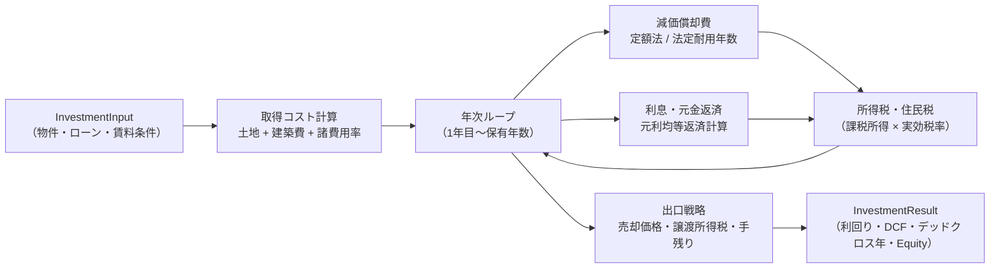
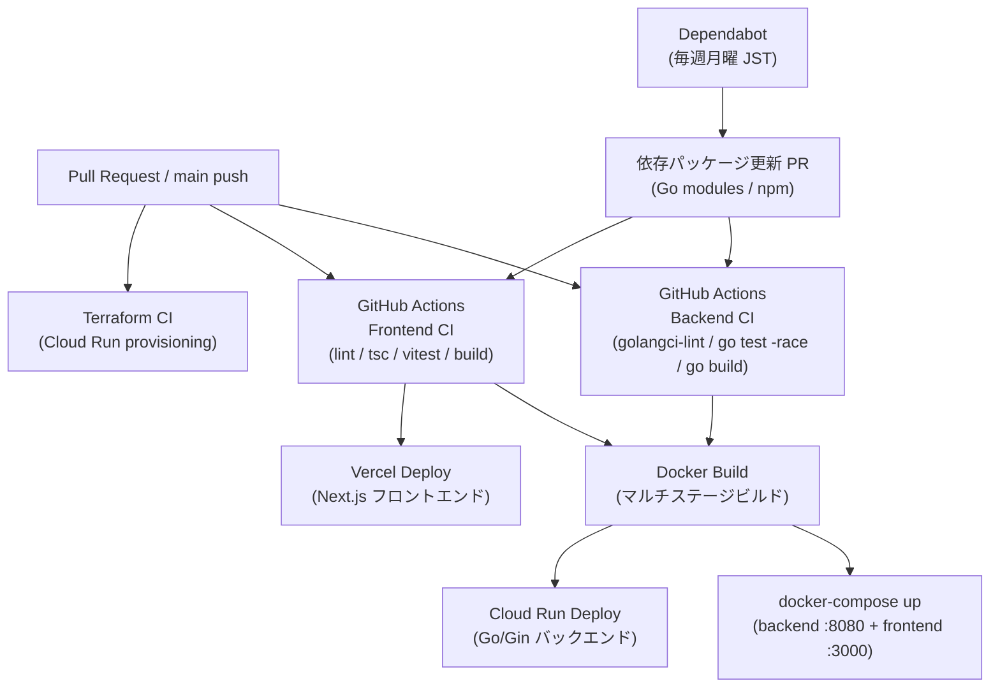
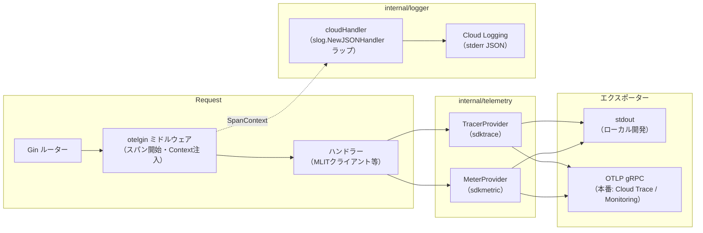

# アーキテクチャ詳細

## 投資計算フロー



### 計算式サマリー

| 計算 | 式 |
|------|----|
| 表面利回り | `(月額賃料 × 12) / 総投資額` |
| 元利均等返済 | `P × r(1+r)^n / ((1+r)^n - 1)` |
| 減価償却（定額法） | `建築費 / 法定耐用年数` |
| デッドクロス | 元金返済額 > 減価償却費 となる最初の年 |
| 長期譲渡税率 | 20.315%（保有5年超） / 39.363%（5年以下） |

**法定耐用年数:** 木造 22年 / 軽量鉄骨 27年 / 重量鉄骨 34年 / RC造 47年

---

## デプロイフロー



### CI ワークフロー詳細

| ワークフロー | トリガーパス | チェック内容 |
|---|---|---|
| Backend CI | `backend/**`, `backend-ci.yml` | `golangci-lint` / `go test -race` / `go build` |
| Frontend CI | `frontend/**`, `frontend-ci.yml` | `lint` / `tsc --noEmit` / `vitest run` / `build` |

Dependabot により Go modules・npm の依存パッケージが毎週月曜（JST）に自動更新される（エコシステムごとに1PR）。

---

## 観測基盤（OpenTelemetry + 構造化ロギング）

### スタック概要

| レイヤー | 実装 | パッケージ |
|---|---|---|
| トレース / メトリクス | OpenTelemetry Go SDK | `backend/internal/telemetry/setup.go` |
| HTTP スパン自動計装 | `otelgin` ミドルウェア | `go.opentelemetry.io/contrib/instrumentation/github.com/gin-gonic/gin/otelgin` |
| 構造化ログ | `slog` JSON ハンドラー（Cloud Logging 準拠） | `backend/internal/logger/logger.go` |
| ログ ↔ トレース相関 | slog ハンドラーが OTel SpanContext からトレースフィールドを注入 | 同上 |

### OTel シグナルフロー



### エクスポーター切り替え

`OTEL_EXPORTER_OTLP_ENDPOINT` 環境変数の有無で自動切り替えする。

| 環境 | `OTEL_EXPORTER_OTLP_ENDPOINT` | トレース出力先 | メトリクス出力先 |
|---|---|---|---|
| ローカル開発 | 未設定 | stdout（整形JSON） | stdout |
| Cloud Run 本番 | `https://...` (OTLP エンドポイント) | Cloud Trace（OTLP gRPC） | Cloud Monitoring（OTLP gRPC） |

### 構造化ログフォーマット（Cloud Logging 準拠）

`logger.Init(os.Stderr)` を `main()` 先頭で呼ぶことでグローバル `slog` デフォルトロガーを設定する。

```json
{
  "severity": "INFO",
  "message": "access",
  "method": "GET",
  "path": "/api/land-prices/stats",
  "status": 200,
  "latency_ms": 42,
  "logging.googleapis.com/trace": "projects/my-project/traces/abc123...",
  "logging.googleapis.com/spanId": "def456...",
  "logging.googleapis.com/trace_sampled": true
}
```

- `severity` / `message` フィールド名は Cloud Logging が自動パースする予約名
- `logging.googleapis.com/trace` を付与することで Cloud Logging UI でトレースと相関表示できる
- `GOOGLE_CLOUD_PROJECT` が未設定（ローカル）の場合、トレースフィールドはスキップされる

### メトリクス計装

`telemetry.Setup()` 後、以下のグローバル計測器が有効になる。

| 計測器名 | 種別 | 説明 |
|---|---|---|
| `analyze.requests.total` | Counter | 投資分析リクエスト数 |
| `mlit.api.request.duration` | Histogram | MLIT API リクエストレイテンシ（秒） |
| `mlit.cache.hits` | Counter | MLIT インメモリキャッシュ ヒット数 |
| `mlit.cache.misses` | Counter | MLIT インメモリキャッシュ ミス数 |

### ログレベル制御

`LOG_LEVEL` 環境変数（`DEBUG` / `INFO` / `WARN` / `ERROR`、デフォルト `INFO`）で動的に変更できる。`LevelCritical`（`slog.LevelError + 4`）は Cloud Logging の `CRITICAL` 重大度に対応するカスタムレベルとして `logger` パッケージで公開している。
